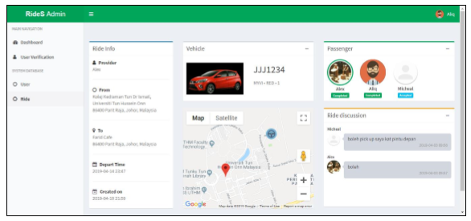
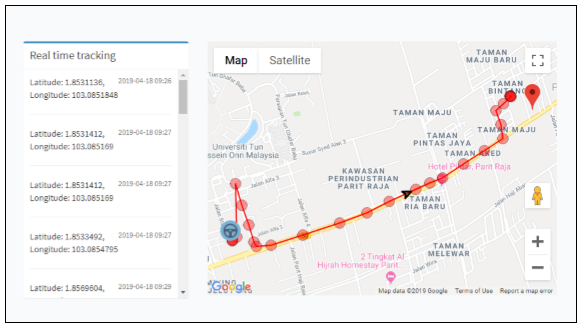

# RideS Admin
This is the admin dashboard for [RideS](https://github.com/chunkhai96/RideS). 

### Requirements
- Install the depencies in requirements.txt using script below:
```
pip install -r requirements
```

### Applications showcase
&nbsp;&nbsp;&nbsp;&nbsp;

##### Watch this video for apps demo:
[RideS demo](https://youtu.be/UE8D9PCm3zk)
